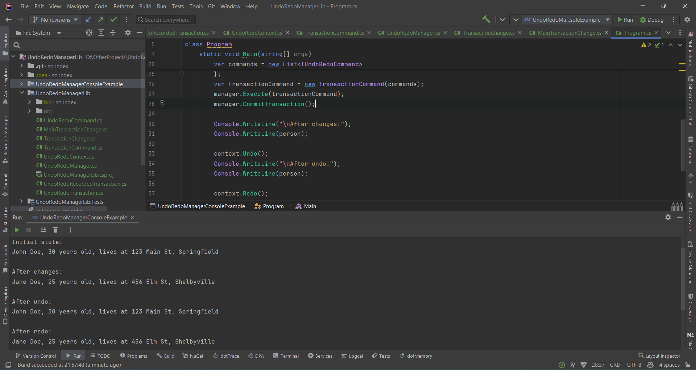

# Just The Write Words

Just The Write Words is a web application designed to help users manage their notes efficiently. 
This project is a test project to explore various capabilities using the ASP.NET platform, such as: Remote Host Service, IP Blocking Service, Worker Service & Periodic Timer, Memory Cache and more.

## Features

- User Registration and Login
- Note Creation, Update, and Deletion
- Note Retrieval by ID, User ID, and with Pagination and Filtration
- Archived Notes Management
- IP Blocking for Security
- Logging and Error Handling
- Email Sending using MailKit, MimeKit and Mailtrap

## Technology Stack

- ASP.NET Core 8: A framework for building web applications and APIs.
- Entity Framework Core 8: An ORM for working with relational databases.
- RESTful API: An architectural style for creating APIs.
- Relational Database: SQL Server: A relational database for data storage.
- Clean Architecture: An architectural approach that ensures separation of concerns and framework independence.
- S.O.L.I.D. Principles: Object-oriented design principles for creating flexible and maintainable systems.
- Unit of Work and Repository Pattern: Patterns for managing transactions and abstracting data access.
- AutoMapper: A library for automatic object mapping.
- FluentValidation: A library for building strongly-typed validation rules.
- Serilog: A diagnostic logging library.
- Swagger: A tool for documenting and testing APIs.
- MailKit and MimeKit: Libraries for sending emails.
- Mailtrap: A service for testing email sending.

## Future Development

This project is still under development. I plan to add more features in the future to further enhance the functionality of the application.

## Contributing

Contributions are welcome. Please fork the repository and create a pull request with your changes.

## Author

Bohdan Harabadzhyu

## License

[MIT](https://choosealicense.com/licenses/mit/)